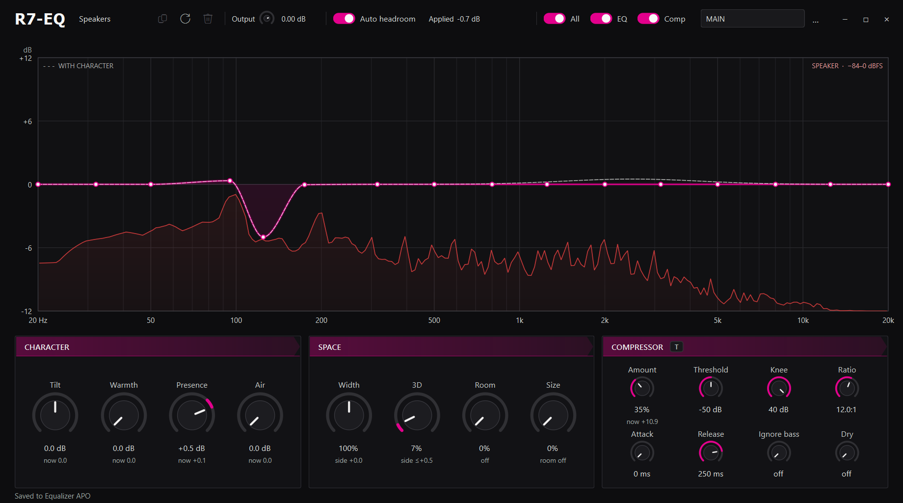

# R7-EQ

R7-EQ is a small EQ app on top of Equalizer APO. I have two outputs, computer speakers and headphones, and I made it mostly to bring down the dynamic range on the speakers and shape the sound the way I like.

You draw the EQ curve with up to 64 points over a live analyzer of what's playing. Under the graph there are dials for the tone (tilt, warmth, presence and air), the stereo space (width, 3D and a small room) and the compressor. The compressor is built from Chrome's own Web Audio compressor code (see `THIRD_PARTY_NOTICES.md`), and the T button sets it to the same settings as the Twitch compressor. A clip guard at the end catches peaks.

Every playback device gets its own profile and presets, and the editor switches to whichever device Windows is playing through. The processing runs inside Equalizer APO, so it keeps working with the window closed.

It's pretty barebones and mostly made for my own setup, but it should work with any setup Equalizer APO supports. I run it on Windows 11 with Python 3.12.

## Setup

1. Install [Equalizer APO](https://sourceforge.net/projects/equalizerapo/) and tick your playback devices in its Device Selector.
2. Install the Python packages: `python -m pip install PySide6 numpy SoundCard pycaw`
3. Put the three DLLs from the release zip in a `plugins` folder next to `R7-EQ.pyw`, or build them with `native\build.cmd` (needs Visual Studio 2022 Build Tools).
4. Give the Windows audio service read access to that folder: `icacls plugins /grant "*S-1-5-19:(OI)(CI)RX"`. Without it the EQ still works, but the compressor, stereo space and clip guard don't run, and R7-EQ tells you.
5. Run `pythonw R7-EQ.pyw`.

The first time, it adds one include block to Equalizer APO's `config.txt` and keeps the original as `config.before-r7-eq.txt`. Closing the window hides it, running it again brings it back, and `--stop` quits.

## Controls

- Double-click the graph to add a point
- Click a selected point again, or right-click it, to reset, edit or remove it
- `Enter` or double-click a point to type exact values, `Delete` removes it
- Drag a dial up or down, with `Shift` for finer steps, and double-click to reset it
- The All switch turns R7-EQ off for every device, and EQ and Comp turn those on or off for the current device

## Headsets with their own surround

If your headset software does its own surround (G HUB and similar), open the Device Selector's troubleshooting options, untick "Install APO" for pre-mix, and untick automatic mode adjustment. The surround keeps working and R7-EQ runs after it.
